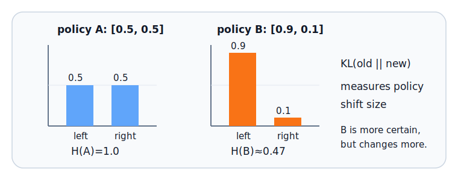

# E.4 信息论与分布距离

本节按信息论的顺序展开：先讲自信息和熵，再讲交叉熵和 KL 散度，最后进入 RLHF、DPO 和互信息。

## 本节路线

| 文章                                                       | 数学节奏                        | 强化学习中的作用             |
| ---------------------------------------------------------- | ------------------------------- | ---------------------------- |
| [E.4.1 自信息、熵与探索](./information-basics)             | 概率事件 → 自信息 → 熵          | 衡量策略随机性和探索程度     |
| [E.4.2 交叉熵与 KL 散度](./information-cross-entropy-kl)   | 编码代价 → 交叉熵 → KL          | 衡量预测分布和策略分布的差异 |
| [E.4.3 KL 约束、RLHF 与 DPO](./information-rlhf-dpo)       | KL 正则 → 对数概率比 → 偏好损失 | 理解对齐训练中的策略约束     |
| [E.4.4 互信息与表征学习](./information-mutual-info)        | 条件不确定性减少 → 互信息       | 衡量表征中保留的任务相关信息 |
| [E.4.5 完整信息论公式](./information-advanced-formulas)    | KL、RLHF、DPO、互信息完整表达   | 统一理解分布距离和偏好优化   |
| [E.4.6 小结、公式与练习](./information-formulas-exercises) | 公式汇总 → 误区 → 练习          | 回顾并检查理解               |
