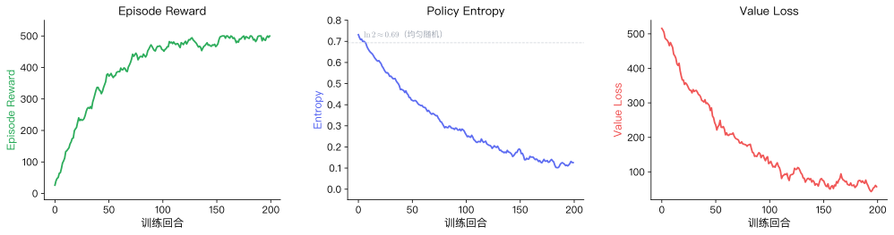
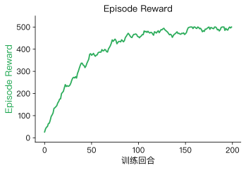
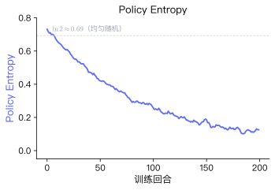
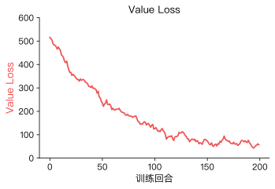
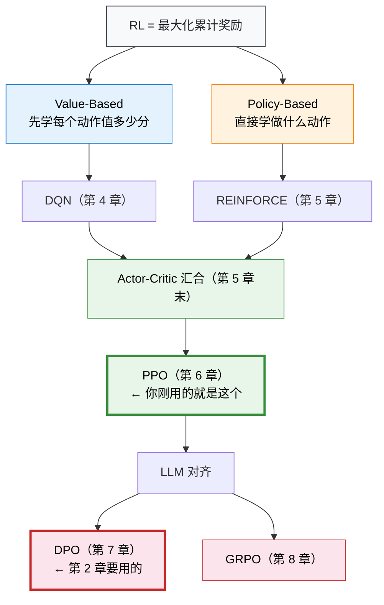

# 1.5 再看指标：读懂 RL 的训练成绩单

> 📁 **本章代码**：[1-ppo_cartpole.py](https://github.com/walkinglabs/hands-on-modern-rl/blob/main/code/chapter01_cartpole/1-ppo_cartpole.py) · [2-ppo_cartpole_tensorboard.py](https://github.com/walkinglabs/hands-on-modern-rl/blob/main/code/chapter01_cartpole/2-ppo_cartpole_tensorboard.py) · [3-pytorch_from_scratch.py](https://github.com/walkinglabs/hands-on-modern-rl/blob/main/code/chapter01_cartpole/3-pytorch_from_scratch.py) · [requirements.txt](https://github.com/walkinglabs/hands-on-modern-rl/blob/main/code/chapter01_cartpole/requirements.txt)

在上一节中，我们理解了 RL 的四个核心要素（状态、动作、奖励、策略），也看到了 SB3 黑盒内部的三步循环。现在回到 1.2 节的那段训练日志，用新学到的概念重新审视每一个数字。

先回顾一下那段日志：

```
-----------------------------------------
| time/              |                  |
|    fps             | 5342             |
|    iterations      | 1                |
|    time_elapsed    | 3                |
|    total_timesteps | 2048             |
| train/             |                  |
|    entropy_loss    | -0.683           |
|    learning_rate   | 0.0003           |
|    loss            | 0.0124           |
|    policy_gradient_loss | -0.0187     |
|    value_loss      | 8.2741           |
-----------------------------------------
```

这里面有五个关键指标，分成两类：**衡量策略表现的指标**和**衡量训练过程的指标**。如果你在 TensorBoard 中观察，会看到类似下图的曲线：



下面逐个解读。

### Episode Reward（回合奖励）

Episode Reward 是一个回合中所有步骤奖励的总和。在 CartPole 中，每步奖励固定为 +1，因此 Episode Reward 就等于杆子保持平衡的总步数。

$$G = \sum_{t=0}^{T} r_t = T$$

其中 $T$ 是回合结束时的步数。在 CartPole-v1 中，$T$ 的上限为 500。



这是衡量 RL 智能体表现的核心指标。一条健康的曲线应该呈现以下特征：

- **整体趋势上升**：策略在改进。如果从头到尾都是一条平线，说明训练没有生效。
- **上升速度先快后慢**：早期从"完全随机"到"基本能平衡"的进步空间大，曲线陡峭；后期改进越来越难，曲线趋于平缓。
- **最终趋于稳定**：策略收敛到一个较好的水平，曲线在某个值附近小幅波动。波动来源于采样的随机性。

如果曲线出现以下异常，说明训练出了问题：

| 异常现象                 | 可能原因                   | 严重程度 |
| ------------------------ | -------------------------- | -------- |
| 突然暴跌到 0             | 策略崩溃，学习率太大       | 严重     |
| 始终不动（卡在 20 左右） | 策略没有在学习，超参数不当 | 严重     |
| 剧烈震荡不收敛           | 训练不稳定，奖励信号太稀疏 | 中等     |
| 稳定在 100 左右不上去了  | 探索不够，陷入局部最优     | 中等     |

### Entropy（策略熵）

训练日志中的 `entropy_loss` 对应的概念是策略熵。熵来自信息论，衡量的是分布的不确定程度。对于离散策略，熵的定义为：

$$H(\pi) = -\sum_{a} \pi(a | s) \log \pi(a | s)$$

在 CartPole 中只有两个动作，所以：

- 均匀分布 $\pi(\text{左}) = \pi(\text{右}) = 0.5$ 时，熵最大，$H = \ln 2 \approx 0.69$。
- 确定性策略 $\pi(\text{左}) = 1, \pi(\text{右}) = 0$ 时，熵最小，$H = 0$。



训练过程中，熵从高到低的变化反映了策略从"广泛探索"到"逐渐确定"的过程。如果你在 TensorBoard 中同时查看 Episode Reward 和 Entropy，会看到前者上升、后者下降——两条曲线形成剪刀交叉，这是 RL 训练的典型特征。

但熵并不是越低越好。如果训练初期熵就迅速降到接近 0，说明策略过早地"锁死"在某个可能并不好的动作模式上，这称为过早收敛（Premature Convergence）。RL 算法通常通过熵正则化来缓解这个问题（在第 6 章 PPO 中会详细讨论）。

> **动手实验**：运行 [2-ppo_cartpole_tensorboard.py](https://github.com/walkinglabs/hands-on-modern-rl/blob/main/code/chapter01_cartpole/2-ppo_cartpole_tensorboard.py)，在 TensorBoard 中同时勾选 `rollout/ep_rew_mean` 和 `train/entropy_loss`，观察两条曲线的变化。

### Value Loss（价值损失）

训练日志中的 `value_loss` 是 Critic 网络的损失值。Critic 的工作是预测状态价值函数 $V(s)$，即"从当前状态出发，未来预期能拿多少总奖励"。Value Loss 衡量的是 Critic 的预测值与实际回报之间的差距：

$$\mathcal{L}_{\text{value}} = \frac{1}{|B|} \sum_{i \in B} \left(V(s_i) - G_i\right)^2$$

其中 $V(s_i)$ 是 Critic 对状态 $s_i$ 的预测价值，$G_i$ 是从该状态出发的实际累积奖励。



训练初期，Critic 还没学会准确评估局面（value_loss 很大）。随着训练推进，Critic 的预测越来越准确（value_loss 逐步减小）。

需要注意的是：**value_loss 减小不等于策略在变好**。它只说明 Critic 的评估更准了，策略本身的表现要看 Episode Reward。如果 value_loss 长期不降或者反而增大，通常意味着 Critic 没有跟上策略的变化。

### Policy Gradient Loss（策略梯度损失）

日志中的 `policy_gradient_loss` 是策略网络的损失值。回顾 1.4 节的 REINFORCE 核心公式：

$$\mathcal{L}_{\text{policy}} = -\log \pi(a | s) \cdot G_t$$

这个值的大小本身不太重要，重要的是它的符号和趋势：

- 在健康训练中，这个值通常在一个小范围内波动（比如 -0.01 到 -0.05）。
- 如果突然变成很大的正数或负数，可能意味着策略更新出了问题。

初学阶段不需要深究这个指标。到了第 6 章学习 PPO 的裁剪机制时，我们会重新回到这里。

### Learning Rate（学习率）

日志中的 `learning_rate = 0.0003` 是 Adam 优化器的学习率，控制每次参数更新的步长：

$$\theta \leftarrow \theta - \alpha \nabla_\theta \mathcal{L}$$

- 学习率太大（如 0.01）：每步更新太猛，策略容易崩溃。
- 学习率太小（如 0.000001）：每步更新太温和，训练极慢。
- SB3 的默认值 0.0003 对 CartPole 这类简单任务效果良好。

> **动手实验**：打开 [3-pytorch_from_scratch.py](https://github.com/walkinglabs/hands-on-modern-rl/blob/main/code/chapter01_cartpole/3-pytorch_from_scratch.py)，把学习率从 `3e-4` 改成 `3e-2`（增大 100 倍），重新运行。你会看到训练曲线剧烈震荡甚至崩溃。

## 指标速查表

| 指标                     | 数学定义                              | 健康表现            | 异常信号                   |
| ------------------------ | ------------------------------------- | ------------------- | -------------------------- |
| **Episode Reward**       | $G = \sum_{t=0}^{T} r_t$             | 持续上升 → 趋于稳定 | 暴跌到 0 / 始终不动        |
| **Entropy**              | $H = -\sum_a \pi(a\|s) \log \pi(a\|s)$ | 从高到低逐步下降    | 过快降到 0 / 长期不降      |
| **Value Loss**           | $\frac{1}{\|B\|}\sum(V(s_i) - G_i)^2$ | 逐步减小            | 长期不降 / 反而增大        |
| **Policy Gradient Loss** | $-\log \pi(a\|s) \cdot G_t$           | 小范围波动          | 突然出现极端值             |
| **Learning Rate**        | $\theta \leftarrow \theta - \alpha \nabla \mathcal{L}$ | 默认值即可          | 调大 → 崩溃；调小 → 学不动 |

## 本章小结

在第 1 章中，你完成了四件事：

1. **运行了第一个 RL 训练**：几秒钟就让一个小车学会了平衡杆子。
2. **学会了观察训练过程**：读懂了 Episode Reward、Entropy、Value Loss 等核心指标，知道什么是健康的训练曲线、什么是异常信号。
3. **理解了 RL 的基本框架**：状态、动作、奖励、策略——这四个要素构成了所有 RL 问题的共同骨架。
4. **拆开了 SB3 的黑盒**：看到了 `model.learn()` 背后的三步循环——策略网络、采样轨迹、策略更新。

你可能已经注意到了：我们从头到尾没有告诉智能体"杆子向右倒的时候应该向右推"这样的规则。它完全是通过试错，从每步 +1 的反馈信号中自己摸索出了平衡的策略。

## 全景导航：RL 的两条路线

你刚才跑的 CartPole 训练，背后的算法叫 PPO。它很厉害，但现在你不需要理解它的细节——只需要知道它在整个 RL 版图上的位置。

所有 RL 算法都在回答同一个问题："怎么让 Agent 选出累计奖励最大的动作？"但有两条截然不同的思路：



- **Value-Based**（蓝色）：先搞清楚"每个动作值多少分"（Q 值），然后选分数最高的。代表是第 4 章的 DQN。
- **Policy-Based**（橙色）：跳过打分，直接学"什么情况做什么动作"的策略。代表是第 5 章的 REINFORCE。
- 两条路线在 **Actor-Critic** 架构中汇合——Actor 学策略，Critic 学价值。这就是 PPO 的骨架。
- 在 LLM 时代，DPO 绕过了 PPO 的奖励模型，GRPO 绕过了 Critic 网络——路线越来越简洁，但底层逻辑不变。

这张图会在后续每章的开头再次出现。现在只需要记住一件事：**你刚才用的 PPO，就是两条路线汇合之后的产物。接下来第 2 章的 DPO，是 PPO 在 LLM 时代的简化版。**

在下一章中，我们将看看 RL 不只是让小车平衡杆子——它还能让大语言模型学会对齐人类偏好。核心循环仍然是这四个要素。

## 参考文献

[^1]: Mnih, V., et al. (2013). Playing Atari with Deep Reinforcement Learning. _arXiv preprint_. [arXiv:1312.5602](https://arxiv.org/abs/1312.5602)

[^2]: Raffin, A., et al. (2021). Stable-Baselines3: Reliable Reinforcement Learning Implementations. _Journal of Machine Learning Research_, 22(268), 1-8.

[^3]: Sutton, R. S., et al. (1999). Policy Gradient Methods for Reinforcement Learning with Function Approximation. _Advances in Neural Information Processing Systems_, 12.
