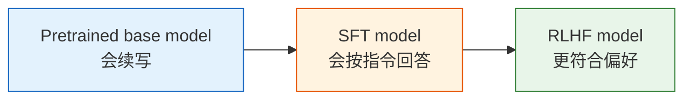

# 8.1 为什么 base model 还不是 assistant

RLHF 的起点不是从零预训练，而是一个已经训练好的 **base model**。它会续写文本、补全代码、模仿语料里的写作风格，但这还不等于它会稳定地扮演助手。

一个 base model 面对用户问题时，最自然的目标仍然是“预测下一个 token”，而不是“理解用户意图并给出有帮助的回答”。所以它可能继续补全用户的话，可能生成论坛式碎片，也可能在安全、诚实和格式遵循上非常不稳定。



本章建议用两类小模型做实验：

| 模型                         | 为什么适合                                     |
| ---------------------------- | ---------------------------------------------- |
| `HuggingFaceTB/SmolLM2-360M` | 国外小参数路线更标准，适合对标 SmolLM 训练配方 |
| `Qwen/Qwen2.5-0.5B`          | 中文表现更友好，参数量也适合教学实验           |

我们不会在这一章从零预训练模型。预训练是 RLHF 之前的独立工程，本章只把它当作输入 artifact：加载一个公开 base checkpoint，观察它的原始行为，然后进入后训练。

## 先看 base model 的行为

最小实验可以很简单：用同一组 prompt 分别测试 base、SFT、RLHF 三个模型，比较回答风格的变化。

```python
# ==========================================
# 观察 base model 是否真的像 assistant
# ==========================================
from transformers import AutoModelForCausalLM, AutoTokenizer

model_name = "HuggingFaceTB/SmolLM2-360M"
tokenizer = AutoTokenizer.from_pretrained(model_name)
model = AutoModelForCausalLM.from_pretrained(model_name, device_map="auto")

prompt = "请用三句话解释什么是强化学习。"
inputs = tokenizer(prompt, return_tensors="pt").to(model.device)

outputs = model.generate(
    **inputs,
    max_new_tokens=120,
    do_sample=True,
    temperature=0.7,
)

print(tokenizer.decode(outputs[0], skip_special_tokens=True))
```

你要观察的不是“它能不能说出几个相关词”，而是下面这些 assistant 能力：

| 维度     | base model 常见问题         | 后训练目标                  |
| -------- | --------------------------- | --------------------------- |
| 指令遵循 | 继续补全 prompt，而不是回答 | 明确回应用户请求            |
| 格式稳定 | 输出格式随机                | 按要求输出段落、列表或 JSON |
| 诚实性   | 不知道也硬编                | 能承认不确定                |
| 安全性   | 对高风险请求缺少边界        | 知道拒绝或转向安全建议      |
| 有帮助性 | 空泛、散乱                  | 具体、结构化、可执行        |

## 本章要产出什么

这一章最终会产出三个模型版本：

1. **Base model**：公开预训练基座，作为起点和对照组。
2. **SFT model**：用指令数据微调后，学会稳定回答。
3. **RLHF model**：用 Reward Model + PPO 进一步优化偏好。

评估时必须同时比较这三个版本。只比较 SFT 和 RLHF 容易漏掉一个问题：RLHF 可能提升了偏好胜率，但也可能在某些基础能力上比 base 或 SFT 退化。

下一节先看标准 RLHF 流水线的全貌：每个阶段的输入、输出和验收指标是什么——[标准 RLHF 流水线](./standard-rlhf-pipeline)。
