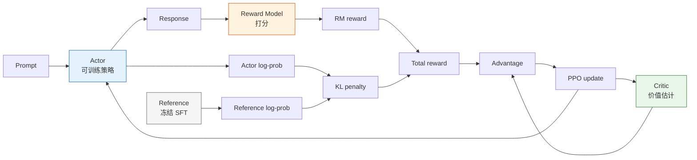

# 8.5 PPO-RLHF：按奖励练习

有了 SFT 模型和 Reward Model，经典 RLHF 的最后一步就是用 PPO 继续优化策略。InstructGPT 这类流程里，PPO 阶段不是“一个模型自己训练自己”，而是四个角色一起工作：

| 角色                 | 来源                | 作用                              |
| -------------------- | ------------------- | --------------------------------- |
| Actor                | SFT 模型继续训练    | 生成回答，并被 PPO 更新           |
| Reference            | 冻结的 SFT 模型     | 提供 KL 约束，防止 Actor 偏离太远 |
| Reward Model         | 偏好数据训练得到    | 给 Actor 生成的回答打分           |
| Critic / Value Model | 通常从 Actor 初始化 | 估计价值函数，降低 PPO 方差       |



## 一次 PPO-RLHF step 发生了什么

PPO-RLHF 的核心循环可以拆成六步：

1. 从 prompt 数据集中采样一批问题。
2. Actor 生成回答。
3. Reward Model 给回答打分。
4. Reference 计算同一段回答的 log-prob，用来得到 KL 惩罚。
5. Critic 估计 value，和 total reward 一起算 advantage。
6. PPO 用裁剪目标更新 Actor 和 Critic。

```python
# ==========================================
# PPO-RLHF 训练循环：概念版
# ==========================================
for batch in prompt_dataloader:
    prompts = batch["prompt"]

    # 1. Actor 生成回答
    responses, actor_logprobs = actor.generate_with_logprobs(prompts)

    # 2. Reward Model 打分
    rm_scores = reward_model.score(prompts, responses)

    # 3. Reference 计算 KL
    ref_logprobs = reference_model.logprobs(prompts, responses)
    kl_penalty = actor_logprobs - ref_logprobs

    # 4. 总奖励 = RM 分数 - KL 惩罚
    rewards = rm_scores - beta * kl_penalty

    # 5. Critic 估计优势
    values = critic.value(prompts, responses)
    advantages, returns = compute_gae(rewards, values)

    # 6. PPO 更新 Actor 和 Critic
    ppo_update(
        actor=actor,
        critic=critic,
        prompts=prompts,
        responses=responses,
        old_logprobs=actor_logprobs,
        advantages=advantages,
        returns=returns,
    )
```

这段代码省略了很多工程细节，但它抓住了经典 RLHF 的本质：Reward Model 给方向，Reference 拉住边界，Critic 降低方差，PPO 控制更新幅度。

## 为什么需要 Reference

如果只最大化 RM 分数，Actor 会很快偏离 SFT 模型，进入 RM 没见过的区域。这个区域里 RM 的分数不再可靠，模型可能写出很长、很空、很模板化甚至有害的回答，却拿到高分。

Reference 的作用是提供一个“不要离原来的 assistant 太远”的约束：

$$
R_{total}(x, y) = r_{RM}(x, y) - \beta D_{KL}(\pi_\theta(y|x) \| \pi_{ref}(y|x))
$$

这里的 $\pi_{ref}$ 通常就是冻结的 SFT 模型。$\beta$ 越大，Actor 越难偏离 SFT；$\beta$ 越小，Actor 越容易探索，也越容易 reward hacking。

## 为什么需要 Critic

PPO 不是只看“这个回答得了几分”，还要判断“这个回答比当前平均水平好多少”。Critic 用来估计 value，进而计算 advantage：

$$
A_t = R_t - V_\phi(s_t)
$$

如果没有 Critic，奖励信号的方差会很大，训练更不稳定。后面的 GRPO 会尝试用组内相对分数替代 Critic，但在经典 RLHF 里，Critic 是 PPO 阶段的重要组件。

## TRL 小实验里的对应关系

在 TRL 的小参数实验里，你不一定需要手写四个模型类，但要知道每个配置项背后的角色：

| TRL 概念                        | RLHF 角色    |
| ------------------------------- | ------------ |
| policy model                    | Actor        |
| ref model                       | Reference    |
| reward model 或 reward function | Reward Model |
| value head                      | Critic       |
| `kl_coef` / `target_kl`         | KL 约束      |
| `ppo_epochs` / `cliprange`      | PPO 更新强度 |

小模型实验的目标不是追求最强效果，而是让你真正看懂这四个角色如何一起工作。大参数框架只是把同一个结构拆成分布式服务。

## 训练稳定性工具箱

PPO-RLHF 的难点不只是“能不能更新”，而是“更新后别崩”。旧版章节里单独展开过稳定性和 reward hacking，这里把它们收进 PPO 主线：

| 工具           | 作用                               | 重点观察                   |
| -------------- | ---------------------------------- | -------------------------- |
| KL 惩罚        | 防止 Actor 偏离 SFT reference 太远 | `kl_mean` 是否超过目标区间 |
| 自适应 `beta`  | KL 过高就拉紧，KL 过低就放松       | reward 是否被 KL 完全压住  |
| 学习率 warmup  | 避免训练初期梯度过猛               | loss / grad norm 是否异常  |
| 梯度裁剪       | 防止极端样本导致爆炸               | `grad_norm` 是否尖刺       |
| 奖励归一化     | 控制 RM 分数尺度                   | reward 分布是否漂移        |
| 长度和重复监控 | 捕捉 reward hacking                | 回答长度、n-gram 重复率    |

健康的 PPO-RLHF 通常不是 reward 一路狂飙，而是 reward 缓慢上升、KL 保持在目标范围、回答长度没有异常增长、输出多样性没有明显下降。只要出现“reward 上升但长度和重复率同步暴涨”，就要先暂停训练，回到 RM 数据和奖励设计检查。

旧稿里对 KL、warmup、梯度裁剪、奖励归一化和失败模式有更长的工程展开，已保留在 [训练稳定性与奖励黑客](./training-stability-hacking)。

常见失败模式可以快速定位到对应的修复动作：

| 失败现象           | 可能原因                 | 检查方法                  | 修复方案                 |
| ------------------ | ------------------------ | ------------------------- | ------------------------ |
| Loss 变成 NaN      | 梯度爆炸 / 学习率太大    | 检查梯度范数              | 降低学习率、加强梯度裁剪 |
| 奖励不动           | 学习率太小或 KL 惩罚太大 | 检查 KL 散度变化          | 降低 `beta` 或增大学习率 |
| 模型输出乱码       | 参考漂移太严重           | 检查 KL 是否异常大        | 增大 `beta`、降低学习率  |
| 模式坍缩           | 策略熵过低               | 检查 entropy 和重复率     | 加熵正则、降低学习率     |
| 奖励上升但质量下降 | reward hacking           | 人工抽检和 judge 对比     | 多维奖励、对抗性数据增强 |
| 回答越来越长       | 长度 hack                | 检查 length-reward 相关性 | 加长度惩罚，重新校准 RM  |

## 本节小结

经典 RLHF 的 PPO 阶段可以压缩成一句话：**让 Actor 追求 RM 给出的偏好奖励，同时用 Reference 和 PPO 约束它不要走偏，再用 Critic 降低更新噪声。**

PPO-RLHF 训练循环搭好之后，不能只看 reward 是否上涨。下一节我们会用 benchmark、偏好评估和人工抽检确认模型真的变好，也会专门检查 reward hacking 和能力回退——[评估：RLHF 到底有没有变好](./evaluation)。
