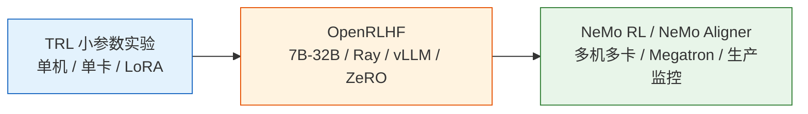

# 8.7 从小参数到大参数——同一条 RLHF 流水线怎么放大

本章的小参数实验用 TRL 跑通，是为了让你在一张消费级显卡或较小云实例上看清楚 RLHF 的完整结构。但工业训练关心的是另一件事：当模型从 360M、0.5B 放大到 7B、32B、70B 甚至更大时，这条流水线还能不能跑起来。

答案是：**算法结构基本不变，系统工程完全变重**。



## 小参数版本：TRL 看清楚结构

小参数实验最重要的价值是可理解。你能直接看到：

- SFT 阶段如何把 base model 改造成 assistant。
- Reward Model 如何用 chosen/rejected 学会排序。
- PPO 阶段如何同时使用 Actor、Reference、Reward Model 和 Critic。
- KL、长度、reward、偏好胜率如何一起监控。

这时最合适的技术栈是 `transformers`、`datasets`、`peft`、`trl`、`accelerate`。模型可以选 `HuggingFaceTB/SmolLM2-360M`、`Qwen/Qwen2.5-0.5B`、`EleutherAI/pythia-410m` 这类参数量较小的 base model。

```text
base checkpoint
  -> SFTTrainer
  -> RewardTrainer
  -> PPOTrainer
  -> evaluation + human/LLM judge
```

这不是生产性能最优的路线，但非常适合学习经典 RLHF 的组成部件。

## 中等参数版本：OpenRLHF 看工程扩展

当模型到 7B 以上，瓶颈开始从“代码能不能写出来”变成“rollout 和训练吞吐能不能跟上”。PPO-RLHF 需要模型不断生成回答，再让 RM 打分，再回到训练，这个 generate-train loop 会让普通训练框架很吃力。

OpenRLHF 这类框架的价值在于把几个系统问题打包解决：

| 问题         | 小参数 TRL      | 大参数 OpenRLHF 思路              |
| ------------ | --------------- | --------------------------------- |
| Rollout 速度 | 直接 `generate` | 用 vLLM / Ray 做高吞吐生成        |
| 显存压力     | LoRA 或单卡     | ZeRO、张量并行、流水并行          |
| 多模型调度   | 同进程较简单    | Actor、RM、Critic、Ref 分角色部署 |
| 数据流       | Python loop     | 分布式队列和 rollout buffer       |
| 监控         | 本地日志        | 实验平台、checkpoint、异常恢复    |

算法上你仍然在做 SFT、RM、PPO；只是每一步都被拆成分布式系统。

## 大参数版本：NeMo RL / NeMo Aligner 看生产训练

70B 级别以后，训练框架不仅要跑得动，还要可恢复、可观测、可复现。NVIDIA NeMo RL / NeMo Aligner 这类框架更接近生产训练视角：多机多卡、Megatron/FSDP、分布式 checkpoint、混合精度、模型并行、数据并行和完整监控都必须一起考虑。

大参数 RLHF 最难的地方通常不是 PPO 公式，而是以下问题：

- **四模型常驻成本**：Actor、Reference、Reward Model、Critic 都要占显存或推理资源。
- **生成和训练切换**：rollout 是推理负载，PPO update 是训练负载，两者资源形态不同。
- **奖励模型吞吐**：RM 每个回答都要打分，可能成为瓶颈。
- **KL 和长度监控**：一旦策略偏移太快，损失可能还没坏，输出已经坏了。
- **checkpoint 与恢复**：长时间训练中断后，Actor、Critic、optimizer、scheduler、rollout 状态要一致恢复。
- **评估闭环**：每个 checkpoint 都要跑固定 benchmark、偏好评估和安全抽检。

## 小模型实验和大模型工程的映射

| 本章小实验         | 大参数训练对应物                                  |
| ------------------ | ------------------------------------------------- |
| `SFTTrainer`       | 分布式 SFT，通常配合 LoRA、FSDP、ZeRO 或 Megatron |
| `RewardTrainer`    | 分布式 RM 训练，单独验证 RM accuracy / margin     |
| `PPOTrainer`       | Actor-RM-Critic-Ref 分布式 PPO 系统               |
| 本地 JSON 偏好数据 | 标注平台、数据版本、质量审计、去重和去污染        |
| 简单 judge prompt  | 多 judge、多维 rubric、人类仲裁                   |
| 本地评估脚本       | 自动 benchmark、A/B test、红队、安全回归          |

这张表说明一件事：小模型实验不是玩具，它是大模型训练的缩影。只要你理解了每个 artifact 的角色，换成大参数框架时就不会迷路。

## 什么时候该换框架

| 规模    | 推荐路线                                           |
| ------- | -------------------------------------------------- |
| 135M-1B | TRL，优先理解流程                                  |
| 1B-7B   | TRL + Accelerate / DeepSpeed，可以继续用 LoRA      |
| 7B-32B  | OpenRLHF，重点解决 rollout 与分布式训练            |
| 70B+    | NeMo RL / NeMo Aligner，重点解决多机多卡与生产监控 |

不要过早上重框架。如果你还没在小模型上跑通 SFT、RM、PPO 和评估，直接上 7B/70B 只会把算法问题和系统问题混在一起，调试会非常痛苦。

## 本节小结

经典 RLHF 的结构在小模型和大模型上是一致的：base model 先 SFT，再训练 RM，最后 PPO 优化策略，并用评估闭环防止 reward hacking 和能力回退。区别在于，大模型训练需要把这条简单流水线扩展成分布式系统。

到这里，第 8 章完成了经典 RLHF 的主线。下一章我们会问一个自然的问题：既然这套流程这么重，能不能省掉一些组件？这就是 DPO、GRPO、RLVR 等现代 post-training 方法的出发点——[后训练对齐](../chapter09_alignment/intro)。
