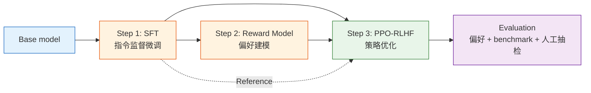

# 8.2 标准 RLHF 流水线

本章的主线参考 OpenAI InstructGPT：先做 SFT，再训练 Reward Model，最后用 PPO 做 RLHF。它不是唯一的后训练方法，但它是理解 DPO、GRPO、RLVR 等现代方法之前最重要的标准参照。



## 三个阶段，三个 artifact

| 阶段     | 输入                       | 输出                          | 验收指标                              |
| -------- | -------------------------- | ----------------------------- | ------------------------------------- |
| SFT      | 指令-回答数据              | 会按指令回答的 assistant 起点 | 格式遵循、基础人工观感、SFT loss      |
| RM       | chosen/rejected 偏好对     | 能给回答打分的 Reward Model   | held-out accuracy、margin、过拟合检查 |
| PPO-RLHF | SFT model + RM + prompt 集 | 偏好更好的策略模型            | 偏好胜率、KL、长度、回归 benchmark    |

这里最容易误解的是：SFT 和 RM 不是“准备工作”，它们本身就是 RLHF 成败的主要来源。SFT 数据差，后面 PPO 会在错误的起点上放大问题；RM 学偏了，PPO 会认真地朝错误方向优化。

## 反馈从哪里来

经典 RLHF 里的 H 是 human feedback，但真实工程里反馈来源通常是混合的：

| 来源             | 用途                         | 风险                   |
| ---------------- | ---------------------------- | ---------------------- |
| 人类标注         | 高质量种子数据、最终校准     | 贵、慢、一致性有限     |
| AI Judge / RLAIF | 扩展偏好数据、快速迭代       | 放大 judge 偏见        |
| 规则验证         | 数学、代码、格式等可验证任务 | 覆盖不了开放式对话质量 |
| 线上反馈         | 点赞、踩、复制、编辑重发     | 噪声大，需要聚合       |

本章仍以经典 human preference 为主线，但会在数据工程和评估里引入 AI Judge、规则检查和人工抽检。这样既保持 InstructGPT 的标准结构，也不把课程写成过时的纯人工标注流程。

## RLAIF、CAI 和 Self-Play 怎么并入主线

旧版章节里单独讲过 RLAIF、自我博弈和自我进化。它们不应该作为 08 的独立主线小节，而应该放回“反馈来源”这个位置：它们本质上是在回答**偏好数据从哪里来，如何更快迭代**。

| 方法                    | 放在流水线哪一步       | 作用                       | 需要的护栏                 |
| ----------------------- | ---------------------- | -------------------------- | -------------------------- |
| RLAIF                   | 生成偏好对 / RM 训练集 | 用强模型替代部分人工标注   | 人类抽检、judge 一致性检查 |
| Constitutional AI       | 生成 chosen/rejected   | 按原则自我批评、自我修订   | 宪法原则质量、人类校准     |
| Self-Play / Debate      | 生成候选回答和难例     | 让模型和历史版本互相竞争   | 多样性监控、外部评估锚点   |
| Self-Rewarding / 自进化 | 多轮数据飞轮           | 模型自评、自批、自改再训练 | 外部 RM 或人工评估防止退化 |

这里的关键不是“完全替代人类”，而是**用 AI 扩展规模，用人类校准方向**。如果完全依赖 AI Judge，judge 偏爱冗长回答、固定模板或某种风格时，偏见会被下一轮训练继续放大。工业实践通常是混合策略：人类提供高质量种子数据和最终校准，AI Judge 承担大规模扩展和快速迭代。

旧稿里对 RLAIF、Constitutional AI、Self-Play 和数据飞轮有更长的展开，已集中放到 [8.8 旧稿补充与实战材料](./legacy-materials)。

## 数据飞轮放在哪里

数据飞轮不是单独的一种算法，而是把 SFT、RM、PPO 和评估连接成可迭代系统：

```text
部署模型
  → 收集 badcase、用户反馈、评测失败样本
  → 生产新的 SFT / preference 数据
  → 训练 SFT 或 RM
  → PPO-RLHF 更新策略
  → 评估通过后再部署
```

这个飞轮的关键指标包括迭代周期、数据有效率、评测覆盖率和回退率。小参数课程实验里可以把它压缩成一轮：先准备固定数据，跑 SFT/RM/PPO，再用评估结果反推下一轮应该补什么数据。

## 两个数据飞轮案例

**Reasoning 数据循环。** 推理任务的优势是很多答案可以被规则验证。模型对同一道题采样多条回答，验证器判断正确与否，再把正确回答强化、错误回答弱化。评测后仍然做错的题目会被聚类，继续定向生成类似题目。

```text
采样 N 条回答
  → 验证器判断正确/错误
  → 组内排序：正确 > 错误，更短且正确 > 冗长且正确
  → 训练更新
  → 在 GSM8K / MATH / HumanEval 等评测集上检查
  → 收集失败题型，继续生产相似数据
```

**Agent 轨迹数据循环。** Agentic RL 的数据不是普通文本，而是模型和环境交互后留下的轨迹。成功轨迹可以作为正例，失败轨迹可以拆出“部分成功”片段，也可以修订成更好的轨迹后再进入训练。

```text
Agent 执行任务
  → 收集成功/失败轨迹
  → 成功轨迹作为 chosen
  → 失败轨迹分析原因：工具调用错、规划错、观察理解错
  → 针对高频失败类型补数据
  → 训练后在 SWE-bench / WebArena 等任务上回归测试
```

这两个案例原本是旧数据循环页里的内容，现在放在标准流水线里更合适：它们不是 08 的额外章节，而是说明 RLHF 系统如何持续获得更好的数据。

## 与第 9 章的关系

经典 RLHF 很强，但很重。它需要训练 RM，需要 Critic，需要 Reference，还要处理 PPO 的不稳定性。第 9 章的现代 post-training 方法基本都在回答同一个问题：这套流程能不能简化？

- DPO：能不能不显式训练 Reward Model？
- GRPO：能不能不用 Critic？
- RLVR：能不能不用主观偏好，改用可验证奖励？

所以 08 要先把标准流程讲清楚。只有知道标准 RLHF 重在哪里，才知道后面的简化到底省掉了什么。

下一节进入第一阶段：用 SFT 把 base model 教成 assistant 起点——[SFT：教模型按指令回答](./imitation-learning-pipeline)。
