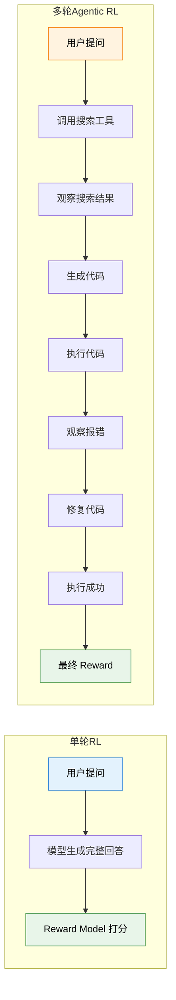

# 12.1 多轮交互 RL 与信用分配

上一章我们看到了 GRPO 如何用可验证奖励来训练大模型的推理能力。但那依然是"单轮"的——模型一次性生成完整回答，然后对最终结果打分。现实中的智能体不是这样工作的。一个真正有用的 Agent 需要**连续多步行动**：搜索信息、执行代码、观察结果、调整策略。每一步都可能改变后续所有步骤的走向，而奖励信号往往只在最后才出现。这一节我们就来拆解这个全新的 RL 范式。

## 从单轮到多轮：不只是"多走几步"

单轮 RL 和多轮 RL 的区别，不是简单的"走一步变成走七步"。它改变了 RL 问题的整个结构。让我们用一个具体的例子来感受这个变化：



表面上看，区别是"步骤多了"。但数学结构上有三个根本性的变化：

**动作空间扩展了**。在单轮 RL 中，模型的动作只有一个——生成下一个 token。在多轮 RL 中，模型需要在多个异构动作之间选择：是继续生成文本？还是调用搜索工具？还是执行一段代码？这些动作的类型完全不同，不能简单地拼成一个大的动作空间。

**奖励延迟了**。单轮 RL 中，模型生成完回答就立刻拿到 reward。但在多轮场景中，7 轮交互之后才出最终结果，中间没有任何反馈。模型需要学会在"没有即时反馈"的情况下做出正确的决策。

**信用分配变难了**。这是最核心的挑战。假设 7 轮交互最终失败了——是第 2 轮的搜索词写错了？还是第 5 轮的代码有 bug？还是第 6 轮的修复方向完全偏了？一个最终的"失败"信号，你该怎么分摊到 7 个步骤上？

## Agentic MDP：为智能体建模

让我们用第 3 章学过的 MDP 框架来形式化这个问题。一个 Agentic 系统可以建模为一个特殊的 MDP：

- **状态 $s_t$**：当前对话历史 + 已调用的工具返回结果 + 环境的当前状态。注意这个状态是**累积增长**的——每走一轮，状态就多一段历史信息。这和标准 MDP 的"状态转移"不同，更像是一个不断扩展的上下文窗口。
- **动作 $a_t$**：生成文本 / 调用工具 A / 调用工具 B / ...。动作空间是**异构**的——不同类型的动作有完全不同的效果和约束。
- **转移 $P(s_{t+1}|s_t, a_t)$**：环境的响应。当模型选择"调用搜索工具"时，搜索引擎返回的结果是不可控的——你搜同一个词，今天和明天的结果可能不一样。这就是环境的"动态性"。
- **奖励 $r(s_t, a_t)$**：中间步骤的 reward 通常为 0，只有最终结果给出 1（成功）或 0（失败）。这是一个极度**稀疏**的奖励信号。

$$R_{\text{total}} = \sum_{t=1}^{T} \gamma^t \cdot r_t$$

其中 $T$ 是总轮数，$\gamma$ 是折扣因子，$r_t$ 是第 $t$ 轮的即时奖励。在大多数 Agentic 场景中，只有 $r_T$ 不为 0（最终结果的 reward），中间的 $r_1, r_2, \ldots, r_{T-1}$ 都是 0。

这和第 5 章学过的 REINFORCE 面临的困境如出一辙——$G_t$ 包含了从当前步到结束的所有随机性，方差极大。只不过现在每一步不再是简单的"选左或选右"，而是"决定调用哪个工具、生成什么内容"，复杂度上升了几个数量级。

## 信用分配：7 轮失败，怪谁？

信用分配（Credit Assignment）是 RL 的经典难题，在 Agentic 场景中变得尤为尖锐。考虑这样一个场景：

> 用户问："2024 年诺贝尔物理学奖得主是谁？他们的主要贡献是什么？"
>
> Agent 的 7 轮交互：
>
> 1. 调用搜索工具，搜索"2024 Nobel Physics"——返回了正确结果
> 2. 调用搜索工具，搜索得主的论文——返回了相关论文
> 3. 生成一段总结——包含了得主名字但不完整
> 4. 调用搜索工具搜索更多细节——搜索词拼写错误，返回无关结果
> 5. 基于错误信息生成补充说明——内容开始偏离
> 6. 调用代码工具画图——代码本身没问题
> 7. 给出最终答案——答案错误（因为第 4 步的搜索词写错了）

最终 reward = 0（失败）。但问题是：第 1、2、3、6 步其实做得不错，只有第 4 步犯了错，第 5 步被第 4 步带偏了。如果你简单地把"失败"归咎于所有步骤，那么第 1 步的"正确搜索"也会被惩罚——这显然不合理。

这个例子揭示了多轮信用分配的核心困境：**早期步骤的错误会"级联传播"到后续所有步骤，但后续步骤本身可能是正确的（基于错误输入做出了合理推理）**。

## ORM vs PRM：两种信用分配策略

面对这个困境，研究者们提出了两种截然不同的策略：

### ORM：只看结果（Outcome Reward Model）

ORM 的思路极其简单粗暴——**不给中间步骤打分，只看最终结果**[^lightman]。整条轨迹如果成功，所有步骤都得到正向信号；如果失败，所有步骤都得到负向信号。

$$r_1 = r_2 = \cdots = r_{T-1} = 0, \quad r_T = \begin{cases} 1 & \text{成功} \\ 0 & \text{失败} \end{cases}$$

ORM 的优势是**简单且便宜**——你只需要知道最终结果对不对，不需要标注中间步骤。对于可验证的任务（代码是否通过测试、数学答案是否正确），甚至完全不需要人工标注。

ORM 的劣势是**信号稀疏**。7 轮交互只有 1 个 reward 信号，模型很难从这个信号中学到"具体哪一步该改进"。这就像考试只告诉你总分，不告诉你哪道题错了——你知道自己考砸了，但不知道该复习什么。

### PRM：每步都评（Process Reward Model）

PRM 的思路是**给每一步都打分**。不只是"最终答案对不对"，而是"每一步的推理过程是否正确"。

$$r_t = f_{\text{PRM}}(s_1, a_1, s_2, a_2, \ldots, s_t, a_t)$$

其中 $f_{\text{PRM}}$ 是一个专门训练的"过程奖励模型"，它看了从第 1 步到第 $t$ 步的完整历史，判断第 $t$ 步是否正确。[^prs]

PRM 的优势是**信号密集**——每一步都有明确的学习信号，模型可以精确地知道"第 4 步的搜索词写错了，但第 3 步的总结做得不错"。这大大加速了学习过程。

PRM 的劣势是**标注成本极高**。你需要为每一步都标注"正确/错误"，这比只标注最终结果的工作量大了 $T$ 倍。而且"中间步骤是否正确"往往比"最终答案是否正确"更难判断——推理过程可能有多种合理的路径。

|          | ORM                     | PRM                               |
| -------- | ----------------------- | --------------------------------- |
| 信号密度 | 稀疏（只有最终 reward） | 密集（每步都有 reward）           |
| 标注成本 | 低（只看结果）          | 高（每步都要标注）                |
| 学习速度 | 慢（信号少，方差大）    | 快（信号多，方差小）              |
| 适用场景 | 可验证任务（代码/数学） | 复杂推理（需要精细指导）          |
| 代表工作 | GRPO（第 8 章）         | Math-Shepherd[^mathshepherd]、PRS |

### SALT：介于 ORM 和 PRM 之间的第三条路[^salt]

SALT 提供了一个巧妙的中间方案：**不需要训练 PRM，但比纯 ORM 精细得多**。它的核心思路是——对同一个 prompt 采样多条轨迹，构建一个**轨迹图**：图中的节点是每一步的动作，如果两条轨迹在某一步做了相同的动作，它们就共享同一个节点。通过分析图的结构，可以量化每一步对最终结果的贡献。

直觉上：如果一个步骤被很多**成功轨迹**共享，但很少出现在失败轨迹中，那它大概率是个好步骤——应该得到正向的 advantage。反之，如果某步骤只出现在失败轨迹中，它大概率拖了后腿。SALT 利用这种图结构来计算每个步骤的 advantage，完全不需要额外的奖励模型或人工标注——只需要最终结果的二元信号（成功/失败），就能推导出步骤级的精细 advantage。

这让 SALT 在 GRPO 框架中特别好用：GRPO 已经在组内采样多条轨迹做比较，SALT 在此基础上进一步细化到步骤级别，为长程任务提供更稳定的训练信号。

## Turn-Level Discounting：越早犯错，责任越大

无论用 ORM 还是 PRM，多轮 RL 都需要处理一个时间维度的问题：**早期步骤的错误影响更大**。直觉上很好理解——第 1 步就走错了方向，后面每一步都在错误的基础上展开；而第 6 步犯的小错，第 7 步还有机会纠正。

为了建模这个直觉，研究者引入了**Turn-Level Discounting**：

$$R = \sum_{t=1}^{T} \gamma^t \cdot r_t$$

其中 $\gamma < 1$ 是折扣因子。注意这里的 $\gamma^t$ 不是对"未来"打折，而是对"过去"的步骤赋予不同的权重。在实际实现中，更常见的做法是**反向折扣**——从最终结果往回推，越早的步骤折扣越大：

```python
def compute_turn_rewards(turn_rewards, gamma=0.9):
    """计算多轮 RL 的折扣累积回报"""
    T = len(turn_rewards)
    returns = []
    G = 0
    # 从最后一轮往前累计
    for t in reversed(range(T)):
        G = turn_rewards[t] + gamma * G
        returns.insert(0, G)
    return returns

# 示例：7 轮交互，只有最后一轮有即时 reward
# turn_rewards = [0, 0, 0, 0, 0, 0, 1.0]
# discount gamma = 0.9
# 返回: [0.531, 0.590, 0.656, 0.729, 0.810, 0.900, 1.000]
# 越早的步骤，折扣越大 → 对最终结果的"责任"被稀释
```

这个实现和第 5 章 REINFORCE 中的 $G_t$ 计算完全一样——只是现在每一步是一个完整的"轮次"（包括文本生成和工具调用），而不是单个 token。

## 代表性框架

### MLMT-RL：多粒度奖励[^mlmt]

MLMT-RL（Multi-Level Multi-Turn RL）的核心洞察是：**不同粒度的 reward 携带不同信息**。Turn-level reward 告诉你"这一轮做得好不好"，Episode-level reward 告诉你"整条路径对不对"。MLMT-RL 在两个粒度上同时分配 reward，实验显示比单层 GRPO 高 14 个百分点。

### Verlog：变长 Episode 处理[^verlog]

Verlog（CMU）解决的是一个更实际的工程问题：不同的任务需要不同的交互轮数。简单问题可能 3 轮就解决了，复杂问题可能需要 15 轮。传统的 RL 框架通常假设固定长度的 episode，Verlog 支持变长 episode 的多轮 RL 训练，并引入了 turn-level reward + discounting 的组合策略。

### AgentGym-RL：对抗长程训练的策略崩塌[^agentgym]

上面提到的框架都没有解决一个关键问题：**长程训练中的策略崩塌（Policy Collapse）**。当 episode 轮数增加到 10 轮以上时，模型容易陷入"总是输出同一种安全但低效的策略"——比如每一步都选择"继续搜索"而不是"给出答案"。AgentGym-RL 提出的 ScalingInter-RL 方法通过**渐进式课程学习**来缓解这个问题：先在短 episode（3-5 轮）上训练，逐步扩展到长 episode（10-15 轮）。模型先学会"怎么在简单场景下做出正确的单步决策"，再学"怎么把这些决策串联成长程策略"。这种渐进式训练使长程训练变得稳定，避免了策略崩塌。AgentGym-RL 已被 ICLR 2026 收录，代码和训练环境均已开源。

### Web-Shepherd：PRM 在真实场景中的落地[^webshepherd]

理论上有 PRM 就能解决信用分配问题，但实际中"谁来做 PRM"是个难题——为每个步骤标注"对/错"成本极高。Web-Shepherd 是首个专为网页导航设计的**步骤级过程奖励模型**，它能自动评估 Agent 在每一步的操作是否正确。实验表明，用 Web-Shepherd 提供步骤级 reward，GPT-4o-mini 的性能提升了 10.9%，而成本仅为使用 LLM 做判官的 1/10。这说明 PRM 不只是理论上的美好愿景——在特定领域（如 Web 导航），领域特化的 PRM 可以低成本、高效率地提供密集的步骤级信号。Web-Shepherd 被 NeurIPS 2025 接收为 Spotlight 论文。我们在下一节的 Web Agent 部分会更详细地讨论它的具体应用。

<details>
<summary>思考题：如果一个 Agent 在 7 轮交互中，第 4 步犯了错但第 5 步成功纠正了，最终结果正确。ORM 和 PRM 分别会给出什么信号？</summary>

**ORM**：最终成功 → 所有步骤得到正向信号。第 4 步的错误被"原谅"了，第 5 步的纠正被隐式奖励了。问题在于：模型同时也被鼓励去犯第 4 步那种错误，因为"反正后面能纠正"。这可能导致模型学会"先犯错再修复"的低效策略。

**PRM**：第 4 步得到负向信号（这一步做错了），第 5 步得到正向信号（成功纠正了错误），其他正确步骤得到正向信号。模型被精确地告知"第 4 步不该那么做，第 5 步的纠正是好的"。这是一个更精确的学习信号。

这个例子说明了 PRM 的核心优势：它能区分"碰巧成功"和"正确地成功"。

</details>

<details>
<summary>思考题：为什么说多轮 RL 的信用分配比单轮 RL 的 token 级信用分配更难？</summary>

在单轮 RL 中（如第 6 章的 PPO），每个 token 的贡献虽然也不容易量化，但至少满足两个有利条件：(1) token 是同构的——都是同一类型的动作（生成文本）；(2) token 之间的影响是局部的——第 3 个 token 对第 100 个 token 的影响通常是间接的。

在多轮 RL 中，这两个有利条件都不成立：(1) 动作是异构的——"调用搜索工具"和"生成一段文字"是完全不同类型的动作；(2) 影响是全局的——第 1 轮的搜索结果决定了后续所有轮次的输入，影响链更长、更复杂。

</details>

## 实战代码：多轮 RL 的 Reward 计算

让我们把前面的理论整合成一段完整的代码。这段代码演示了如何对一个 Agentic episode 计算 turn-level 的 reward，支持 ORM 和 PRM 两种模式：

```python
from dataclasses import dataclass
from typing import List, Optional
import numpy as np

@dataclass
class Turn:
    """一个交互轮次：动作 + 观察结果"""
    action_type: str    # "text" | "tool_call"
    content: str        # 动作的具体内容
    observation: str    # 工具返回结果或环境响应
    prm_score: Optional[float] = None  # PRM 给的分数（如果有的话）

def compute_episode_reward(
    turns: List[Turn],
    final_success: bool,
    gamma: float = 0.95,
    use_prm: bool = False,
) -> List[float]:
    """
    计算多轮 RL 的 turn-level reward。
    支持 ORM（只看最终结果）和 PRM（每步评估）两种模式。
    """
    T = len(turns)
    immediate_rewards = []

    for t, turn in enumerate(turns):
        if t == T - 1:
            # 最后一轮：根据最终结果给 reward
            r = 1.0 if final_success else 0.0
        elif use_prm and turn.prm_score is not None:
            # PRM 模式：用过程奖励模型的分数
            r = turn.prm_score * 0.1  # 缩放到合理范围
        else:
            # ORM 模式：中间步骤 reward = 0
            r = 0.0
        immediate_rewards.append(r)

    # 反向计算折扣累积回报 G_t
    returns = np.zeros(T)
    G = 0
    for t in reversed(range(T)):
        G = immediate_rewards[t] + gamma * G
        returns[t] = G

    return returns.tolist()

# 示例：7 轮交互
turns = [
    Turn("tool_call", "搜索 2024 Nobel Physics", "返回正确结果", prm_score=0.9),
    Turn("tool_call", "搜索得主论文", "返回相关论文", prm_score=0.85),
    Turn("text", "生成总结", "包含名字但不完整", prm_score=0.6),
    Turn("tool_call", "搜索更多细节（拼写错误）", "返回无关结果", prm_score=0.2),
    Turn("text", "补充说明", "内容偏离", prm_score=0.3),
    Turn("tool_call", "代码画图", "执行成功", prm_score=0.8),
    Turn("text", "最终答案", "答案错误", prm_score=0.1),
]

orm_returns = compute_episode_reward(turns, final_success=False, use_prm=False)
prm_returns = compute_episode_reward(turns, final_success=False, use_prm=True)

print("ORM 模式下的折扣累积回报:", [f"{r:.3f}" for r in orm_returns])
print("PRM 模式下的折扣累积回报:", [f"{r:.3f}" for r in prm_returns])
```

这段代码的核心逻辑是第 5 章学过的 $G_t$ 计算，只不过现在 $G_t$ 代表的是"从第 $t$ 轮到 episode 结束的折扣累积 reward"。对比 ORM 和 PRM 的输出，你会发现 PRM 模式下每轮的回报值差异更大——这正是 PRM 的优势所在，它让模型能更精确地区分"好步骤"和"坏步骤"。

## 与前面章节的联系

多轮 RL 的信用分配问题和第 5 章的策略梯度定理一脉相承。REINFORCE 用蒙特卡洛采样来估计 $G_t$——从当前步到结束的累积回报。多轮 RL 做的是同样的事，只不过"步"从单个 token 变成了一个完整的轮次。第 6 章的 PPO 通过引入价值函数（Critic）来降低方差——同样的思路在多轮 RL 中依然适用，只是 Critic 需要评估的不是"当前 token 的价值"，而是"当前轮次的价值"。

下一节我们来拆解 Agentic RL 的数据工程核心——[轨迹合成与数据工程](./trajectory-synthesis)，看看训练数据从哪里来。

## 参考资料

[^lightman]: Lightman H, et al. "[Let's Verify Step by Step](https://arxiv.org/abs/2305.20050)." arXiv:2305.20050, 2023. —— 提出 ORM vs PRM 的对比框架，证明过程监督（PRM）在数学推理上显著优于结果监督（ORM）。

[^mathshepherd]: Wang P, Li L, Shao Z, et al. "[Math-Shepherd: Verify and Reinforce LLMs Step-by-step without Human Annotations](https://arxiv.org/abs/2312.08935)." ACL 2024. —— 自动化过程奖励标注，无需人工标注中间步骤。

[^prs]: Xu P, Li Z, et al. "[Principle Process Reward for Search Agents](https://openreview.net/forum?id=zN1aqLhkGm)." ICLR 2026. —— 将过程奖励应用于搜索智能体场景。

[^mlmt]: Singh U, et al. "[Multi-Level Multi-Turn RL Outperforms GRPO: Reasoning with Textual Feedback](https://openreview.net/forum?id=u1RjV99DPu)." ICLR 2026. —— MLMT-RL，在两个粒度上同时分配 reward，比单层 GRPO 高 14 个百分点。

[^verlog]: Chen W-T, et al. "[Verlog: Context-lite Multi-turn RL for Long-Horizon LLM Agents](https://neurips.cc/virtual/2025/128043)." NeurIPS 2025 Workshop. —— 支持变长 episode 的多轮 RL 训练框架。

[^salt]: Li Z, Wang et al. "[SALT: Step-level Advantage Assignment for Long-horizon Agents via Trajectory Graph](https://arxiv.org/abs/2510.20022)." EACL 2026 Findings. —— 通过轨迹图量化每步质量，为 GRPO 提供步骤级 advantage 分配，不需要额外奖励模型。

[^agentgym]: Xi Z, Huang et al. "[AgentGym-RL: Training LLM Agents for Long-Horizon Decision-Making through Multi-Turn RL](https://arxiv.org/abs/2509.08755)." ICLR 2026. —— 用 ScalingInter-RL 渐进式课程解决长程策略崩塌问题。[GitHub](https://github.com/WooooDyy/AgentGym-RL)

[^webshepherd]: Web-Shepherd Team. "[Web-Shepherd: Advancing PRMs for Reinforcing Web Agents](https://arxiv.org/abs/2505.15277)." NeurIPS 2025 Spotlight. —— 首个网页导航专用的步骤级 PRM，成本仅为 LLM 判官的 1/10。
