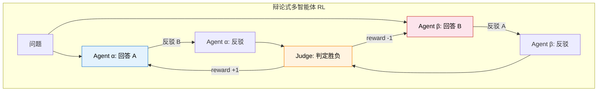
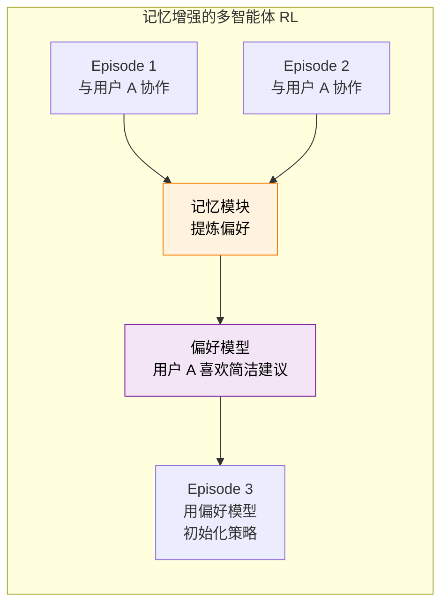

# 13.5 LLM 多智能体强化学习

13.3 节介绍了传统多智能体 RL（MARL）的核心框架——CTDE、IPPO、MAPPO、QMIX。这些算法在机器人协作、多车调度等传统场景中表现出色，但当我们把场景切换到**大语言模型驱动的多智能体系统**时，会面对一系列全新的挑战。

为什么不能直接把 MAPPO 套到 LLM 上？因为传统 MARL 的假设和 LLM 多智能体的现实之间有三道鸿沟：

| 维度             | 传统 MARL（13.3 节）               | LLM 多智能体 RL                              |
| ---------------- | ---------------------------------- | -------------------------------------------- |
| **动作空间**     | 低维连续/离散（移动方向、加速度）  | 自然语言（生成 token 序列）                  |
| **角色异构性**   | 通常同质（多辆出租车、多个机器人） | 高度异构（Coder 和 Reviewer 的能力完全不同） |
| **Episode 结构** | 固定步数或固定终止条件             | 多轮对话，长度差异极大                       |
| **通信方式**     | 参数化的消息向量                   | 自然语言对话（可解释但高维）                 |
| **人类参与**     | 通常无                             | 人机协作是核心场景                           |

这一节我们来拆解 LLM 时代多智能体 RL 的核心问题、典型架构和前沿进展。

## 三种典型架构

### 架构一：角色分工协作

这是最直觉的架构——多个 LLM Agent 扮演不同角色，各自负责擅长的子任务，协作完成一个复杂目标。

```
任务: "修复这个 GitHub Issue"
├── Planner：分析 Issue，制定修复计划
├── Coder：根据计划编写修复代码
├── Reviewer：审查代码质量，提出修改建议
└── Tester：运行测试，验证修复是否有效
```

这种架构和 13.3 节的 DevTeam 例子结构相同，但关键区别在于**RL 训练方式**。传统 MARL 用全局 Critic 评估每个智能体的贡献，但 LLM Agent 的"动作"是一段完整的文本（可能是几百个 token），用传统 Q 值难以评估"这段代码的质量"。

实践中更常用的方案是**结果驱动的 reward**——只看最终结果（Issue 是否修复？测试是否通过？），然后用 12.1 节讨论的信用分配方法（ORM vs PRM）来分配 reward 到各个角色。

### 架构二：辩论对抗

13.4 节介绍了辩论式自博弈训练，这里我们从**多智能体 RL** 的视角重新审视。辩论架构中，两个 LLM Agent 对同一个问题给出不同回答，通过多轮辩论互相挑战，最终由 Judge 判定胜负。

和 13.4 节的区别在于：自博弈通常用**同一个模型的多个实例**，而多智能体视角下的辩论可以用**不同训练策略的模型**。这引入了种群训练（Population Training）的思想——维持多个策略不同的模型，随机配对辩论，避免所有模型收敛到同一个策略。



### 架构三：人机协作

这是 JD 中最关注、也是最具挑战性的架构。LLM Agent 不是和另一个 Agent 协作，而是**和一个真实的人类协作**。例如直播场景中，AI Agent 辅助主播完成选题策划、弹幕互动、节奏把控。

人机协作的独特挑战在于：

**人类行为不可控**。Agent 面对的"环境"包括人类——但人类不是固定的环境。同一个主播今天心情好，可能很配合 Agent 的建议；明天心情差，可能完全忽略。这比传统 MARL 的非平稳性（13.3 节）更严重——至少其他 Agent 的策略是可以通过训练影响的，但人类的行为模式只能适应。

**信任建立是隐式目标**。Agent 不能只学会"完成任务"，还要学会"让人类愿意接受它的建议"。一个总是给出正确建议但语气生硬、时机不当的 Agent，实际效果可能不如一个偶尔出错但沟通自然的 Agent。这意味着 reward 不应该只衡量"任务是否完成"，还要衡量"人类是否满意这次协作"。

**多源稀疏奖励**。reward 信号来自多个源头：任务结果（客观可衡量）、人类反馈（主观且稀疏——不会每一步都给反馈）、系统指标（如直播的观众留存率）。如何把这些不同粒度、不同可靠性的信号融合成统一的 reward，是核心难题。

## LLM 多智能体 RL 的核心挑战

### 挑战一：非平稳性放大

13.3 节讨论过传统 MARL 的非平稳性——当你在学习新策略时，队友也在变。LLM 多智能体把这个挑战放大了：

- **角色异构导致更新不同步**：Coder 模型和 Reviewer 模型的学习速率和更新频率可能不同。当 Coder 升级了代码风格，Reviewer 的审查策略需要重新适应。
- **语言动作空间加剧不稳定性**：传统 MARL 的动作是低维向量，策略变化通常是渐进的。LLM 的动作是语言，策略的一次更新可能导致输出风格完全不同（比如突然从写 Python 切换到写 Java），队友很难快速适应。

**缓解方案**：采用**冻结-轮训**策略——一次只更新一个角色的策略，其他角色保持不变。类似 curriculum learning，先训练稳定的基础角色，再逐个引入更复杂的角色。

### 挑战二：跨角色信用分配

第 12 章讨论了多轮交互中的信用分配（12.1 节）——7 轮交互失败了，该怪谁？多智能体把这个维度进一步扩展：**多个独立决策者同时在行动，谁的贡献最大？**

一个软件项目中，Coder 写了一段代码，Reviewer 发现了潜在 bug 并建议修改，Coder 修改后通过了测试。最终的"通过测试"这个 reward 应该怎么分配？

- Coder 贡献了"写出基本可用的代码"和"根据反馈修改"
- Reviewer 贡献了"发现潜在问题"
- 如果没有 Reviewer 的反馈，Coder 的原始代码可能通不过测试

这和 13.3 节 CTDE 的全局 Critic 思路一致——需要一个看到所有角色动作的"上帝视角"来评估各自贡献。但在 LLM 场景下，"贡献"不只是"动作选得对不对"，还包括"生成的文本质量"、"给出的建议是否有帮助"等更抽象的维度。

**实践方案**：结合过程奖励和结果奖励。过程奖励评估每个角色的中间输出质量（如代码质量分、审查准确率），结果奖励看最终任务是否完成。两者加权组合：

$$R_i = \alpha \cdot R_i^{\text{process}} + (1 - \alpha) \cdot R^{\text{outcome}}$$

其中 $R_i^{\text{process}}$ 是角色 $i$ 的过程奖励，$R^{\text{outcome}}$ 是共享的结果奖励。

### 挑战三：记忆机制与长期策略

在人机协作场景中，Agent 需要记住过去和同一个人协作的经验——上次主播喜欢什么风格的选题？上次用户对哪类建议反应冷淡？这些记忆需要跨 episode 积累，影响未来的策略选择。

这和 DQN 的经验回放（第 4 章）有本质区别：DQN 的经验回放是**原样复用**旧数据，而人机协作的记忆需要**提炼**——从过去的交互中抽象出"这个人喜欢什么"的偏好模型，然后在新的 episode 中使用。



记忆机制的 RL 训练面临一个特殊挑战：**记忆更新本身也需要 RL 优化**。不是简单地"记住所有历史"就有效——记忆容量有限，需要学会"记什么、忘什么"。这可以建模为一个**元学习问题**：外层循环优化记忆策略（记什么、怎么用），内层循环优化任务策略（基于记忆怎么做决策）。

## 代表性工作

### MAPoRL：多智能体协作训练新范式

MAPoRL 将多个 LLM Agent 的协作建模为一个联合策略优化问题。核心创新是引入了**协作奖励**——不只评估每个角色独立完成子任务的效果，还评估角色之间的"配合度"。例如，Coder 生成的代码是否容易被 Reviewer 理解？Tester 的测试用例是否覆盖了 Coder 代码的边界情况？

### M-GRPO：GRPO 的多智能体扩展

回顾第 8 章的 GRPO：同一个模型生成多条回答，在组内比较。M-GRPO 把这个思路扩展到多智能体场景——多个角色的多组输出一起比较。例如，对于同一个编程任务，生成 3 组"Coder-Reviewer-Tester"团队，比较哪个团队的任务完成率更高。

$$\text{Advantage}_i = \frac{R_i - \text{mean}(R_{1..G})}{\text{std}(R_{1..G})}$$

其中 $R_i$ 是第 $i$ 组团队的总体 reward。这保持了 GRPO 的核心优势（不需要 Critic），同时引入了组间竞争来驱动协作能力的提升。

### SAGE：闭环自进化多智能体框架

SAGE 实现了一个**闭环自进化**的多智能体系统：多个 Agent 协作完成任务 → 评估协作效果 → 识别薄弱环节 → 针对性训练薄弱角色的策略 → 重新协作。这个循环类似于 13.4 节的自进化系统，但扩展到了多智能体场景。

### MARTI：多智能体辩论框架

MARTI 通过多智能体辩论来提升推理质量。核心思想是：多个 LLM Agent 对同一个问题进行多轮辩论，每轮都可以看到其他 Agent 的论点并进行反驳。最终的"共识答案"作为训练信号，参与辩论的每个 Agent 都通过 RL 优化自己的辩论策略。

## 与前面章节的联系

| 前面章节                          | 在 LLM 多智能体 RL 中的对应      |
| --------------------------------- | -------------------------------- |
| CTDE 全局 Critic（13.3 节）       | 跨角色信用分配的理论基础         |
| 自博弈 Generator-Judge（13.4 节） | 辩论对抗架构的直接前身           |
| 多轮信用分配 ORM/PRM（12.1 节）   | 跨角色信用分配的方法论基础       |
| GRPO 组内比较（第 8 章）          | M-GRPO 将组内比较扩展到多智能体  |
| DQN 经验回放（第 4 章）           | 记忆机制：从原样复用到提炼偏好   |
| PPO（第 6 章）                    | 多智能体策略优化的基础算法       |
| 训练稳定性（第 10 章）            | 非平稳性放大要求更强的稳定性控制 |
| Bespoke Labs KL=0.001（12.5 节）  | 多智能体场景中 KL 约束同样关键   |

最深刻的联系可能是：**LLM 多智能体 RL 是本书所有核心概念的"最高难度综合应用"**。它需要同时处理多轮信用分配（12.1 节）、策略梯度优化（第 5-6 章）、训练稳定性（第 10 章）、reward 设计（12.5 节）——只是从单智能体扩展到了多智能体，每个问题的难度都提升了一个量级。

## 小结

LLM 多智能体 RL 把传统 MARL 的框架和 LLM 时代的实际需求结合在一起，面对三个独特的挑战：

1. **非平稳性放大**：语言动作空间和角色异构性让多智能体训练更不稳定。冻结-轮训是实用的缓解方案。
2. **跨角色信用分配**：多个独立决策者的贡献难以评估。结合过程奖励和结果奖励是当前最有效的方案。
3. **记忆与长期策略**：人机协作需要跨 episode 的偏好积累。记忆机制本身也需要 RL 优化。

这三个挑战都没有完美的解决方案，但正是这些开放问题让 LLM 多智能体 RL 成为 2025–2026 年最有活力的研究方向之一。

---

下一节我们来讨论另一个重要范式——[离线强化学习（CQL / IQL / DT）](./offline-rl)：当不能在线交互时，如何从历史数据中学习策略？本章的最后，让我们用 PettingZoo 来做一个多智能体 RL 的动手实验——[动手：PettingZoo 多智能体](./pettingzoo)。

## 参考资料

- Guo S, et al. "[MAPoRL: Multi-Agent Reinforcement Learning for LLM](https://arxiv.org/abs/2504.19519)." 2025. —— 多 LLM Agent 协作训练新范式，引入协作 reward。
- Dong H, et al. "[M-GRPO: Multi-Agent GRPO for LLM](https://arxiv.org/abs/2505.17664)." 2025. —— 将 GRPO 扩展到多智能体场景，保持无 Critic 优势。
- Chen Z, et al. "[SAGE: Self-Evolutionary Multi-Agent RL](https://arxiv.org/abs/2505.03727)." 2025. —— 闭环自进化多智能体框架。
- MARTI Team. "[MARTI: Multi-Agent Reasoning Through Interaction](https://arxiv.org/abs/2502.14839)." 2025. —— 多智能体辩论框架。[GitHub](https://github.com/zhiminyu/MARTI)
- Zhang T, et al. "[The Landscape of Agentic Reinforcement Learning for LLMs: A Survey](https://arxiv.org/abs/2509.02547)." 2025. —— Agentic RL 综述，包含多智能体协作板块。
- Li J, et al. "[FlexMARL: End-to-End Training for LLM-based Multi-Agent RL](https://arxiv.org/abs/2502.04387)." 2025. —— 首个联合优化采样、训练及编排的端到端多智能体框架。
